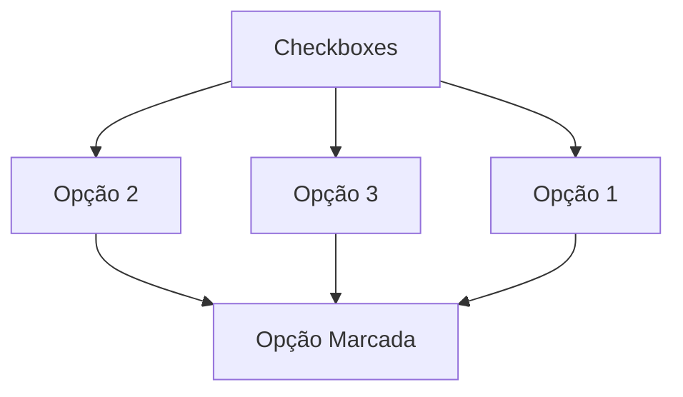
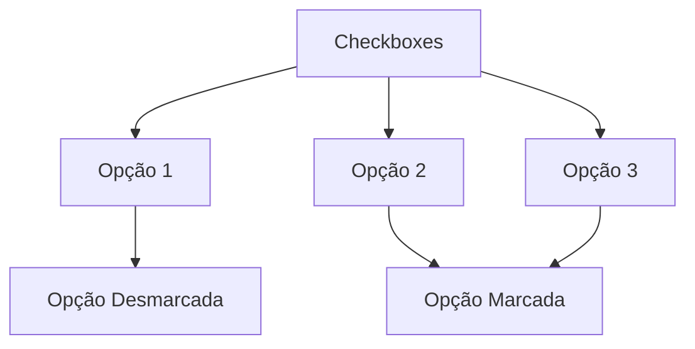
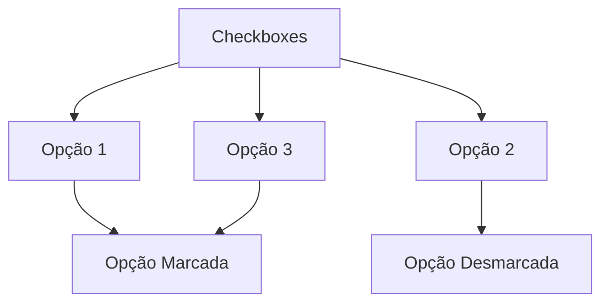

<h1 align="center"> Toggle Switch Checkboxes </h1>
<h6 align="center">Project <a href="https://shapecheck.vercel.app/">Link</a></h6>
<div align="center">


</div>

<details>

<summary  align="center" style="background-color: #ffff00; padding: 10px;">English</summary>

</details>
<br>
<h3>Descrição</h3>

Um pequeno projeto para criar uma caixa de seleção de on/off, com um adicional de três opções onde você só pode marcar duas e a terceira é desmarcada automaticamente, decidi fazer uma piada com o esporte que pratico


<hr>
<h3>Lógica por trás</h3>

Apenas três passos:

1. Importar os elementos do DOM, todas as checkboxes e individualmente cada uma
2. Aplicar um forEach e um event 'change'
3. Função para fazer a checagem

a função deve ficar algo como:
```JavaScript
function checkToggle(toggleChecked) {
    if (toggle1.checked && toggle2.checked && toggle3.checked) {
        if (toggleChecked === toggle1) {
            toggle2.checked = false
        }

        if (toggleChecked === toggle2) {
            toggle3.checked = false
        }

        if (toggleChecked === toggle3) {
            toggle1.checked = false
        }
    }
}
```

a função vai iniciar o primeiro IF apenas quando as três checkboxes forem marcadas, após isso ela vai checar qual checkbox marcada por último e assim aplicar as condicionais




<hr>
<h3>Licença</h3>
Este projeto foi inspirado no projeto número 32 do repositório público <a href="https://github.com/bradtraversy/50projects50days">50 Projects 50 Days</a>


---
